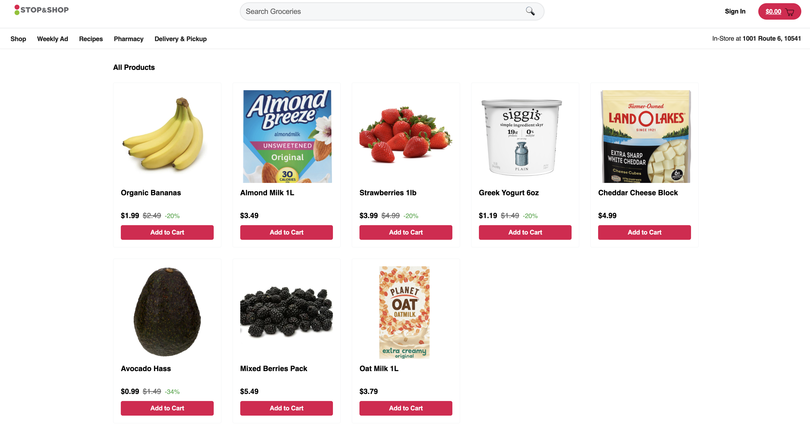
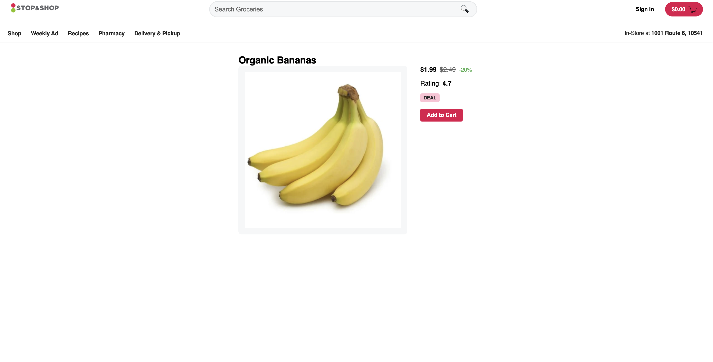
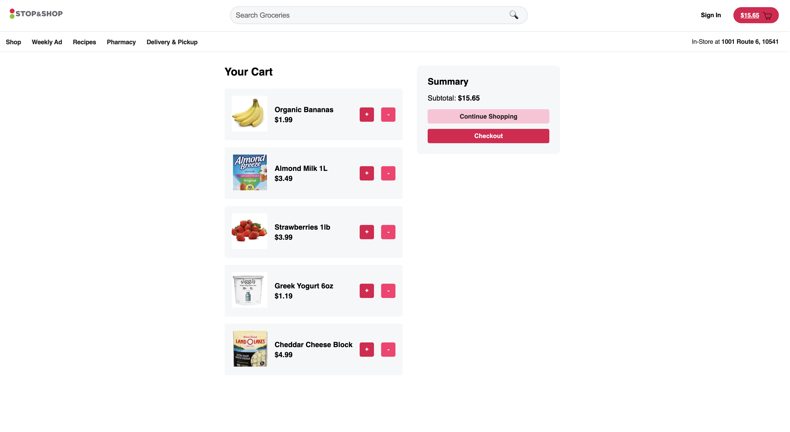
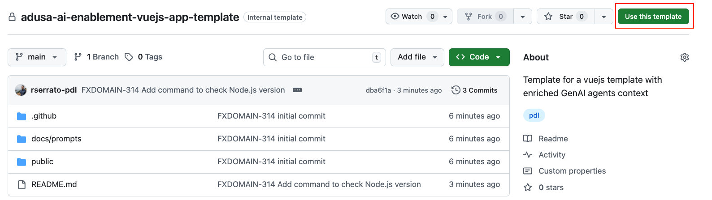
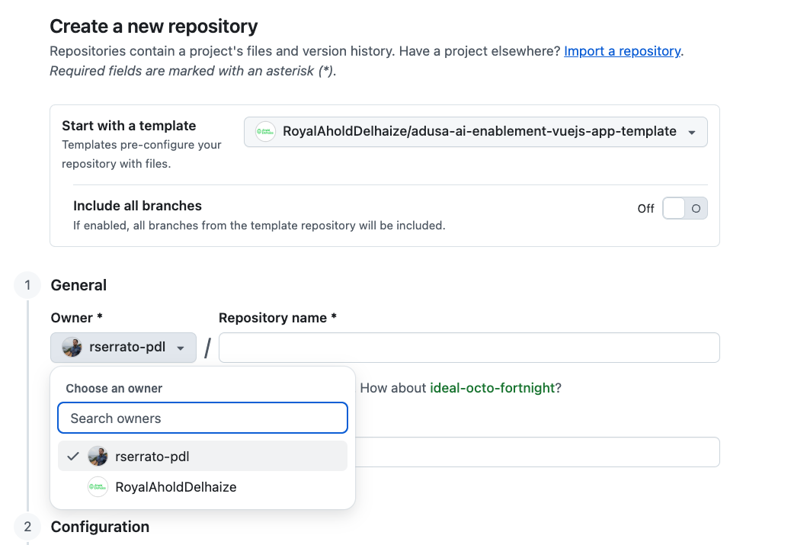
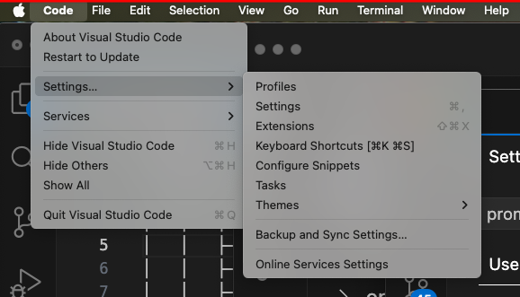
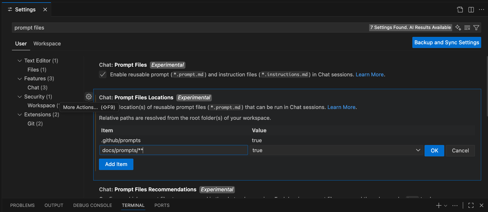
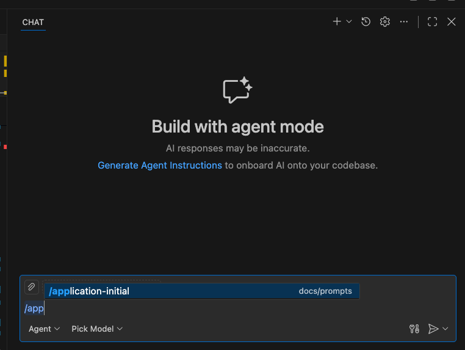

# AI in Action Workshop Level 2 (Frontend)

> Prompt‑driven Vue 3 (Options API) + TypeScript application scaffolded via multi‑phase instructions (Initialization → Building → Coding → Testing). This README captures the authoritative development, testing, and contribution practices adopted after the recent reset & hardening pass.

## Overview

This project provides a structured, test‑driven frontend for the AI in Action Level 2 workshop. All source generation is guided by curated prompt files under `docs/prompts/` to ensure consistency, reproducibility, and traceability.

## Problem Statement

We are going to build a prototype of an ecommerce website for Stop and Shop with a very reduced set of features, the backend will be mocked and the generation will be focused on the Frontend components. The media assets are included in the template.

The goal of the exercise is to show how the enriched context improves the software development experience and efficiency.

The exercise contains the following features:

### Landing Page


---

### Product List Page

This page is loaded when the user clicks on one of the products from the landing page.



---

### Product Details Page

This page is loaded when the user clicks on one of the products from the product list page.



---

### Shopping Cart Page

This page is loaded when the user clicks on the cart button.



---

The user can modify the quantity of the items.

The user can checkout the order, in which case a message will be displayed saying that the order was successful.

---

## Workshop Instructions

### Setting Up The Environment

1. Create a new repo using this current repository as template, name it the way you prefer, e.g. `my-shop-site`, set the owner of the repo to be your github user and not the Ahold Delhaize organization
   - Click at the button `Use this template` when in the code tabe of this repository
     
     

   - Make sure to set the owner of the repo to be your github user and not the Ahold Delhaize organization
  
    

2. Visual Studio Code (VSCode) needs to be installed
   - It can be downloaded from: (https://code.visualstudio.com/download)
   - After installing VSCode clone the github repository and open it as a folder in VSCode

3. Install node and npm, follow this [instructions](docs/instructions/node-instructions.md)
4. Configure the prompt files location in VS Code
   - Open VS Code editor
   - Open VSCode settings (Settings -> Settings)

   

   - Search for `prompt files`
   - Set the path to the `docs/prompts/**`

     

After seeting the prompt files location, VS Code Copilot Chatbot will recognize the prompt files (files that are suffixed with `.prompt.md`) as commands.

**Optional Setting**

Add the following to your settings.json file in VS Code by going to `Settings --> Settings` and look for edit settings.json option

```json
    "chat.tools.terminal.autoApprove": {
        "/^npm .*/": true,
        "/^node .*/": true,
        "/^npx .*/": true,
        "cat .*/": true,
        "ls .*/": true,
        "build.log": true,
        "'EOF_BASE64'": true
    },
```

### Application Code Generation

The application is generated through successive prompt phases. Each phase has a governing prompt (`*.prompt.md`) and reference examples (`*.example.md`) under `docs/prompts/**`. Always update prompt files first if you need to diverge, then regenerate code—never hand‑edit tooling or structure without aligning the prompt.

#### Phase 1: Initialization

Steps:

5. Open Copilot Chat in VS Code
   - Select Agent Mode in the chatbot
   - Select Sonnet 4.5 as model if available otherwise select GPT-5

7. Type `/application-initial` (while typing you will notice that copilot finds this as a command, press tab to select it or click it with your mouse)


   
- running the prompt file as a command in copilot is equivalent to simply use the prompt: `run #file:application-initial.prompt.md`
- you could give extra instructions to the prompt by adding text after the prompt command

Verification (post-run):
1. Directory structure includes expected top-level folders: `src/` (with `components`, `views`, `router`, `store`, `services`, `interfaces`, `shared`, `theme`, `assets`), and `public/`.
2. Core files exist: `src/main.ts`, `src/App.vue`, and a single authoritative `index.html` (preferably at repo root). If both root `index.html` and `public/index.html` appear, remove the duplicate to match the single-root rule.
3. Resolve any unintended extra files by updating the prompt first, then re-run `/application-initial` if a full regeneration is needed.
   - One possible outcome, is that the entry file index.html could be created inside `public` folder, in order to fix that we need to re-run the prompt, try running the following prompt:
     - `/application-initial index.html should be located in the root directory, please fix its current location`

#### Phase 2: Building (Tooling & Configuration)
Command: `/building-main`


Generates: `package.json`, Vite config, Jest config, ESLint, Stylelint, Prettier, Husky hooks, `lint-staged`, TypeScript config.


Actions:
1. Run `/building-main`.
2. Inspect generated files against examples in `docs/prompts/building/*-example.md` (e.g. `package-json-example.md`, `jest-config-example.md`).
3. If the differences are unintentional from the exapmples provided, FIRST edit the corresponding prompt file; THEN re-run the prompt to regenerate that particular dependency's config again `run #file:vite-config-example.prompt.md`.
4. Install dependencies:
  ```bash
  npm install
  ```

Checklist (pass criteria):
- `npm install` completes without peer dependency errors.

#### Phase 2.1: Configuring (Environment & Typed Access)
Command: `/configuring-main` (`docs/prompts/configuring/configuring-main.prompt.md`)
When to Run:
- Preferred AFTER Building but ALWAYS BEFORE Coding; components/services should import from `EnvConsts` instead of touching `import.meta.env` directly.

Generates (if missing):
1. `.env.example` (committed baseline)  
2. `src/env.d.ts` (ambient typings)  
3. `FEATURE_FLAGS.md` (optional; documents `VITE_FEATURE_FLAGS`)  

Conventions:
- Public vars prefixed `VITE_` (`VITE_APP_NAME`, `VITE_API_BASE_URL`, optional `VITE_FEATURE_FLAGS`).
- `.gitignore` must exclude `.env.local`.
- Required vars throw early if missing; feature flags parsed into `FEATURE_FLAGS_LIST`.

Checklist (pass criteria):
- `npm run build` succeeds (even if output is minimal).

Proceed next to Phase 3: Coding (`/coding-main`).

#### Phase 3: Coding (Feature Modules)

You can generate the UI either Incrementally (feature-by-feature with validation gates) or in a Single Aggregate run. Choose Incremental when teaching, debugging, or validating prompt drift; choose Aggregate for fast bootstrap.

Execution Modes:

**Important:** There are two ways of performing this phase, one is to build all the features in one prompt (single run) or to do feature by feature in multiple prompts, see the instructions below:

Choose one option:

- **Option 1:** Single-Run Aggregate (recommended)
  - Run the prompt command: `/coding-main`
  - Run `/coding-main` to produce all modules in one pass.
  - Run the following to verify that the application runs
    ```bash
    npm run dev
    ```
- **Option 2:** Incremental Feature-by-Feature
  - Run the prompt commands from the next table in sequence
  - After running all the prompt commands from the table in sequence:
    - Run `/coding-main` to produce all modules in one pass. Follow with:
      ```bash
      npm run dev
      ```
## Incremental Sequence & Commands:

| Step | Prompt Command | Purpose | Key Verification After Run |
|------|----------------|---------|----------------------------|
| 1 | `/feature-flags` | Create / update feature flags prompt artifacts & ensure `FEATURE_FLAGS.md` and env constants alignment | Files present; no unused flag references; add specs if any logic module generated |
| 2 | `/data-models` | Generate domain interfaces + mock data | `src/interfaces/domain.ts` AND `src/mocks/data.mock.ts` created; arrays exported (mockProducts, mockCategories, mockPromotions, mockSlides); no TS errors; discount derivation works; optional mock spec may be added |
| 3 | `/design-tokens` | Generate SCSS + CSS variable tokens | `src/theme/tokens.scss` present; imported without build error |
| 4 | `/component-main` | Generate all SFCs + specs in one run (Header, Footer, ProductCard, PriceTag, DealBadge, CartSummaryBadge, CategoryGrid, PromotionBanner, Carousel, SearchBar) | Each component has colocated `Name.spec.ts` (smoke + behavior + a11y + edge case); Carousel spec mocks timers |
| 5 | `/layout` | Global layout wrapper | `src/layout/LayoutDefault.vue` + `LayoutDefault.spec.ts` validating slot/router-view & header/footer presence |
| 6 | `/router` | Parent layout + child routes | Router index + spec for route config; dev server runs cleanly |
| 7 | `/homepage` | Homepage view | `HomepageView.vue` + spec verifying conditional zones via flags; start dev server (if not already running) `npm run dev` and visit http://localhost:3000/ to confirm homepage route renders header, flagged zones, and no console errors |
| 8 | `/product-listing` | Product listing view | Listing view + spec asserting rendered product count & list semantics `<ul><li>` |
| 9 | `/product-details` | Product details view | Details view + spec asserting price display & add-to-cart emit |
| 10 | `/cart-store` | Scaffold Vuex cart module + root store wiring | `src/store/cart.ts` + `src/store/index.ts`; create `cart.spec.ts` verifying initial state & mutation cycle |
|11 | `/cart` | Cart view UI | `CartView.vue` + spec for quantity adjust & subtotal display |
|12 | (Test Sweep) `npm test` | Full suite run | All specs pass; coverage ≥ 80%; no missing colocated spec |

After EACH incremental step:
1. Run a focused test sweep (either `npm test` or `npm test -- <newSpecFile>`).
2. Confirm new file has a colocated `*.spec.ts` (except pure interfaces).
3. Address discrepancies by editing the related `*.prompt.md` first, then re-running its command.

Smoke Test Checklist:
- App loads at `http://localhost:3000/` with Homepage route (after Step 6).
- Navigation to Product Listing, Product Details, and Cart routes succeeds after running all the incremental commands (after Step 11).
- Header subtotal updates when adding items.
- No console errors (env access, missing imports, unhandled promises).

Validation Targets:
- Incremental: each step’s new specs pass before moving forward.
- Aggregate: all specs pass immediately after `/coding-main` then `npm test`.
- Feature flags gating works (enable/disable zones by editing `.env.local`).
- Colocated spec coverage: every view, component, layout, and store module has a sibling spec file.
- `npm run dev` runs without errors on port 3000.
- No runtime errors in browser console for missing environment variables (handled by `EnvConsts`).

#### Phase 4: Testing (Specs & Coverage Hardening)
Command: `/testing-main`

Purpose (now that Phase 3 already generated baseline specs):
Phase 4 does NOT primarily "create all tests"; it AUDITS, REFINES, and ENFORCES quality gates on the colocated spec suite produced during Coding. It fills gaps, strengthens weak assertions, raises coverage, and aligns specs with evolving prompt contracts. Only missing or explicitly out‑of‑date spec files are generated; existing specs are updated (not duplicated) when their behavior expectations drift from prompt definitions.

Key Responsibilities:
1. Parity Audit – Ensure every executable `.ts` and every `.vue` (excluding pure interface files) still has a sibling `*.spec.ts` and naming matches (PascalCase + `.spec.ts`).
2. Assertion Quality – Replace shallow smoke tests with behavior + accessibility + edge case assertions (at least 1 of each per component/view/layout/store module).
3. Coverage Gate – Enforce ≥ 80% global line coverage (or updated target) excluding allowed bootstrap/interface files.
4. Advanced Patterns – Add timer mocking (Carousel), feature flag toggling (Homepage), store mutation/action round trips (cart), event emission checks (ProductCard, SearchBar), discount calculation edge case (PriceTag/deriveDiscount).
5. Accessibility – Verify presence of required landmarks, aria attributes, and semantic list wrappers (`<ul><li>` for product listing). Add missing assertions when absent.
6. Env & Flags – Test failure modes in `EnvConsts` (missing required variables, malformed flags) without relying on console noise. Ensure warnings do not throw except for truly required variables.
7. Drift Detection – If prompt requirements for a component changed (e.g., new prop or aria attribute), update the prompt FIRST, then re‑run `/testing-main` to regenerate or patch the affected spec.

Workflow:
1. Run `/testing-main` (optionally with clarifiers: `"audit strengthen coverage"`).
2. Execute full suite:
   ```bash
   npm test
   ```
3. Open coverage report: `coverage/lcov-report/index.html` and list uncovered high‑value lines (business logic branches, conditional renders, store mutations). Avoid padding coverage with trivial tests.
4. For each uncovered branch decide: add a meaningful test OR remove dead code/prompt artifact.
5. If a missing spec file is detected, regenerate just that artifact by re‑running its source prompt (e.g. `/product-details`), then revisit Phase 4 to harden the new spec.

Gap Detection Checklist (run mentally or script later):
| Check | Pass Criteria |
|-------|---------------|
| Colocated parity | Every implementation file has a sibling spec (excluding interfaces) |
| Behavior coverage | Each spec asserts at least one user‑visible outcome or state change |
| A11y coverage | Required roles/aria attributes asserted (Header nav label, search form role, carousel dot attributes) |
| Edge cases | At least one non‑happy path (empty array, missing optional prop, discount absent) per relevant module |
| Feature flags | Both enabled and disabled render paths tested for flagged zones |
| Store cycle | Mutation + getter + action round trip validated |
| Timer logic | Carousel auto‑advance index assertion with mocked timers |
| Env failures | Missing required variable throws early; malformed flags still parse gracefully |

Strengthening Assertions – Prefer:
* Observing DOM text, attributes, emitted events, computed classes.
* Avoid relying solely on internal component instance properties.
* Avoid broad snapshots until markup stabilizes; if used, keep them minimal and pair with precise assertions.

Coverage Improvement Strategy:
1. Sort uncovered lines by importance (business logic > presentation noise).
2. Add focused tests for each untested branch.
3. Remove dead or unused code (and update prompt) rather than writing artificial tests.
4. Re‑run `npm test` and confirm incremental coverage increase—do not chase 100% unless justified.

When to Edit the Testing Prompt:
| Scenario | Action |
|----------|--------|
| Repeated weak assertion pattern | Strengthen examples in `testing-main.prompt.md` then re-run `/testing-main` |
| New component contract (prop/event) | Update its component prompt first; adjust related spec expectations here |
| Coverage target change (e.g. 85%) | Update `{{coverage_target_lines}}` in prompt & README Phase 4 section |

Agent Instructions (Phase 4 context):
* Do NOT regenerate specs that already meet quality; modify only those with gaps.
* Never create duplicate spec filenames; overwrite or enhance existing.
* Prefer `jest.resetModules()` for env/flag isolation tests.
* Use `jest.useFakeTimers()` for time‑driven components and always restore timers after test.
* Fail fast: If coverage < target, list uncovered critical paths before adding tests.

Optional Enhancements (deferred):
* Add a lightweight script to list missing spec siblings (`node scripts/check-spec-parity.mjs`).
* Introduce `@testing-library/vue` for higher‑level interaction tests (future iteration).
* Add visual regression placeholders only after markup stabilizes.

Sample Focused Commands:
```bash
# Run single spec while refining
npm test -- Header.spec.ts

# Watch mode for iterative improvement
npm run test:watch
```

Phase Completion Signals (Testing):
* All parity checks pass.
* Coverage ≥ target.
* No flaky timer or flag tests.
* Specs reflect current prompt contracts (no outdated aria expectations or missing new props).
* No dead code retained solely for coverage.

#### Ongoing Validation Loop (After Any Phase)
Run this lightweight suite whenever a phase completes or prompts change:
```bash
npm run lint
npm test
npm run build
```
If a change spans tooling + code, re-run the relevant prompt(s) instead of manual patching.

#### Drift Control & Regeneration Strategy
| Scenario | Action |
|----------|-------|
| Need a new environment variable | Update `env-consts.prompt.md` then regenerate env constants file. |
| Add a component prop | Edit the component prompt (`*.prompt.md`), re-run only that prompt; update example if changed. |
| Tooling upgrade (e.g. Vite major) | Modify `building-main.prompt.md` + related example configs; re-run `/building-main`; then validate build/tests. |
| Coverage dip below 80% | Add meaningful test OR remove dead code; if pattern recurs, refine testing prompt. |

#### Phase Completion Signals
- Initialization: Folder tree matches prompt & committed baseline.
- Building & Configuring: Tooling passes lint, test stub run, build completes.
- Coding: All mapped features present; dev server runs cleanly.
- Testing: Coverage gate met; failing tests addressed; no skipped critical specs.

#### Troubleshooting During Generation
| Symptom | Likely Cause | Resolution |
|---------|--------------|------------|
| Missing alias resolution (`@/`) | `tsconfig.json` or Vite alias not generated correctly | Re-run `/building-main`; ensure prompt config matches examples. |
| Styles missing tokens | `additionalData` injection string diverged | Compare `vite-config-example.md`; regenerate if changed. |
| Spec can’t import component | Component path or name drifted from prompt | Align prompt & re-run component prompt. |
| Feature flag logic undefined | `EnvConsts` not rebuilt after adding flag | Update `env-consts.prompt.md` then regenerate via targeted prompt. |

#### Recommended Commit Rhythm
1. Commit after each major phase (Initialization, Building, Coding scaffold, Testing baseline).
2. Use conventional commit style (e.g. `build: scaffold tooling via /building-main` or `feat: add product card via /product-card prompt`).
3. Avoid combining tooling upgrades and feature additions in a single commit.
   

## Tech Stack

- Vue 3 (Options API)
- Vite 5.x (bundling & dev server, pinned due to `@vitejs/plugin-vue@4.x` peer range; upgrade path documented below)

## Key Principles
1. Vue 3 Options API only (no Composition API, no `vue-class-component`).
2. 1:1 colocated spec rule.
3. ≥80% global line coverage without padding utilities.
4. Manual Husky hooks (no `prepare`).
5. Global SCSS tokens via Vite `additionalData` injection.
6. Strict TypeScript, alias `@` → `src`.
7. Single authoritative root `index.html` (no duplicate in `public/`).

## Project Structure (High Level)

```
src/
  main.ts            # App bootstrap
  App.vue            # Root component (excluded from coverage)
  components/        # Reusable presentation components (each has .spec.ts colocated)
  views/             # Route-level views (colocated specs)
  router/            # Vue Router setup (+ index.spec.ts)
  store/             # Vuex modules (+ index.spec.ts)
  services/          # API integration & adapters (each service has a .spec.ts)
  theme/             # SCSS partials (tokens, mixins, palette, typography)
  interfaces/        # Pure TS types/interfaces (specs optional; excluded from coverage)
  shims-vue.d.ts     # SFC TypeScript shim (excluded from coverage)
```
Colocated testing replaces prior `tests/unit` tree for clarity and strict 1:1 mapping.

## Testing & Coverage
1:1 spec placement: `src/services/fooService.ts` → `src/services/fooService.spec.ts` (colocated).

## Getting Started

### Prerequisites

- Node.js ≥ 20.x (LTS recommended)
  - Check your node version with command: `node -v`

- pnpm or npm (examples assume npm)

### Install

```bash
npm install
```

### Dev Server

```bash
npm run dev
```

### Build

```bash
npm run build
```

### Preview Production Build

```bash
npm run preview
```

## Testing & Coverage

```bash
npm test            # Run Jest
npm run test:watch  # Watch mode (if configured)
```

Coverage gates (global):
- Lines ≥ 80%
- Critical files must not be excluded except: bootstrap (`src/main.ts`), root shell (`src/App.vue`), pure type/interface declarations.

Guidelines:
- Arrange / Act / Assert pattern in tests.
- No network calls: mock Axios/service layers.
- 1:1 spec placement: `src/services/fooService.ts` → `src/services/fooService.spec.ts`.
- Avoid coverage inflation (no throwaway util modules).

## Linting & Formatting

```bash
npm run lint        # ESLint + Stylelint (if combined script provided)
npm run format      # Prettier write
```

`lint-staged` runs on pre‑commit to format & lint staged files.

## Manual Husky Hooks

Husky is managed manually (no `prepare` script). After `npm install`, ensure hooks exist:

```
.husky/
	pre-commit  # Runs lint-staged & any quick validations
	pre-push    # Can run full test suite before pushing
```

To update a hook, edit the file directly (they are simple shell scripts). Keep them fast; heavy tasks belong in CI.

## SCSS Tokens & Global Styles

### Typography

The global font stack is defined in `src/theme/tokens.scss` and applied in `src/theme/index.scss`:

```
'Trademark', 'effra', 'Helvetica', sans-serif
```

Custom brand faces (Trademark, Effra) are declared via `@font-face` in `index.scss` and served from `/public/fonts/`. To activate them you must provide the actual font files (e.g. `Trademark-Regular.woff2`, `Effra-Regular.woff2`). If licensing prohibits self‑hosting, remove the `@font-face` blocks or replace their `src` URLs with approved CDN endpoints. Fallbacks automatically degrade to Helvetica and the system sans‑serif.

Guidelines:
1. Do not set component‑level `font-family`; rely on the cascade from `html { font-family: var(--font-family-base); }`.
2. Prefer semantic elements and utility classes over hardcoded size tweaks; reference token variables (`--font-size-sm`, etc.).
3. Use `font-display: swap` (already configured) to ensure text remains visible during font load.
4. Validate that the font files collectively stay below ~200KB compressed to avoid layout shifts on slower connections.

If fonts are missing, the browser will fall back silently—no build error occurs. You can verify effective rendering by checking the computed `font-family` in DevTools on body text.

### Web App Manifest

The project includes a minimal Progressive Web App (PWA) manifest at `public/manifest.webmanifest` referenced from `index.html`:

```
<link rel="manifest" href="/manifest.webmanifest" crossorigin="use-credentials" />
```

Key fields:
- `name` / `short_name`: Display names for install banners.
- `start_url`: Root path; adjust if app served from a subfolder.
- `display: standalone`: Launches without the browser UI for an app‑like feel.
- `theme_color` / `background_color`: Used by some browsers for splash screen and UI chrome.
- `icons`: Currently reuse `favicon.png` as placeholder for multiple sizes (32, 192, 512). Replace with real exported assets (transparent PNGs) for proper install quality. Recommended sizes: 48, 72, 96, 128, 192, 256, 384, 512.

Next Steps (optional):
1. Export proper icon set and update the `icons` array with accurate `sizes`.
2. Add a `maskable` purpose icon for better Android adaptive icon rendering.
3. Consider adding `serviceworker` registration for offline caching before calling it a PWA.
4. If auth/session required, remove `crossorigin="use-credentials"` unless you need cookies with manifest fetch.

Manifest updates must precede code changes in prompts if you formalize PWA support.


## Configuration

Environment configuration is intentionally minimal and type‑safe.

### Files
| File | Committed | Purpose |
|------|-----------|---------|
| `.env.example` | Yes | Document baseline public environment variables (prefixed `VITE_`). |
| `.env.local` | No | Developer overrides; ignored by git. Mirrors `.env.example` plus local flags. |
| `src/shared/EnvConsts.ts` | Yes | Single source of truth for validated environment access and feature flag parsing. |
| `src/env.d.ts` | Yes | Ambient TypeScript declarations augmenting `import.meta.env`. |

### Variables
| Name | Required | Description |
|------|----------|-------------|
| `VITE_APP_NAME` | Yes | Application display name (used in headings/UI). |
| `VITE_API_BASE_URL` | Yes | Base URL for API calls (axios instance uses this). |
| `VITE_FEATURE_FLAGS` | No | Comma‑separated feature toggles (e.g. `beta-dashboard,new-router`). Empty = none. |

### Access Pattern
Do not access `import.meta.env` directly in application code. Import from `EnvConsts`:
```ts
import { APP_NAME, API_BASE_URL, FEATURE_FLAGS_LIST } from '@/shared/EnvConsts';

if (FEATURE_FLAGS_LIST.includes('beta-dashboard')) {
  // conditional UI logic
}
```

`EnvConsts` asserts required variables at load time. Missing mandatory variables throw a clear error early, failing fast during development and CI.

### TypeScript Support
`src/env.d.ts` references `vite/client` and defines extended `ImportMetaEnv` ensuring IDE intellisense and compile‑time safety:
```ts
/// <reference types="vite/client" />
interface ImportMetaEnv {
  readonly VITE_APP_NAME: string;
  readonly VITE_API_BASE_URL: string;
  readonly VITE_FEATURE_FLAGS?: string;
}
interface ImportMeta { readonly env: ImportMetaEnv }
```
`tsconfig.json` includes `"types": ["node", "jest", "vite/client"]` so these ambient declarations resolve.

### Feature Flags Strategy
Keep flags additive and ephemeral. Remove code paths once a feature stabilizes instead of accumulating dormant branches. Prefer simple existence checks (`FEATURE_FLAGS_LIST.includes('flag')`) over storing boolean maps unless volume grows.

### Testing
Unit tests may mock feature flags by temporarily overriding `import.meta.env.VITE_FEATURE_FLAGS` *before* requiring `EnvConsts` and calling `jest.resetModules()` between scenarios.

---

Vite injects shared tokens into every SCSS file via `css.preprocessorOptions.scss.additionalData`. Define token sources in `src/theme/_tokens.scss` and reference with `@use` or `@forward` semantics as needed.

## Prompt-Driven Workflow

Phases under `docs/prompts/`:
1. Initialization – base folders & root files.
2. Building – tooling (`package.json`, Vite, Jest, ESLint, Stylelint, Prettier, Husky hooks examples).
3. Coding – feature modules (router, store, services, components, views, theme partials).
4. Testing – spec authoring patterns, coverage thresholds, negative/edge cases.

Developers MUST align new changes with corresponding prompt examples; divergence requires updating the prompt first.

## Dependency & Security Hygiene

- Run `npm audit` after dependency updates.
- Address advisories (e.g., esbuild / Vite) proactively by upgrading pinned versions.
- Keep peer dependency compatibility (adjust plugin and Vite versions together when major bumps occur). Current pin: Vite 5.x with `@vitejs/plugin-vue@4.x`.

### Vite Upgrade Path
1. Monitor `@vitejs/plugin-vue` release notes for a version declaring peer support for Vite 6 or 7.
2. Update Building/Coding/Testing prompts first.
3. Bump `vite` and `@vitejs/plugin-vue` together; run lint, tests, coverage, build.
4. Update this README section with migration date & rationale.

## Known Warnings
| Warning | Origin | Impact | Action |
|---------|--------|--------|--------|
| `Deprecation Warning [legacy-js-api]: The legacy JS API is deprecated and will be removed in Dart Sass 2.0.0.` | Vite internally calls `sass.render` (legacy callback API) | None currently; informational only | Monitor Vite releases; remove note when Vite migrates to modern Sass API |

Tracking: See TODO comment in `vite.config.ts` (Sass 2.0 readiness). No local code changes required.

## Contributing

See `docs/CONTRIBUTING.md` for:
- Branching model
- Commit message conventions
- Code review checklist
- Adding or modifying prompts before code changes

Submit PRs only after ensuring:
- Lint passes
- Tests & coverage thresholds pass
- No new audit warnings of high severity

## Troubleshooting

| Issue | Resolution |
|-------|------------|
| Jest jsdom errors | Verify `jest-environment-jsdom` present & setup files paths correct. |
| Coverage below threshold | Add/expand meaningful tests; do not create artificial utilities. |
| SCSS token not found | Confirm `_tokens.scss` exported via `@forward` and injection string matches. |
| Peer dependency warnings | Align plugin versions with current Vite major. |

## License

Workshop internal use. Add proper license text if distributed externally.

---
Generated & maintained via prompt governance. Update prompts before structural or tooling changes.
